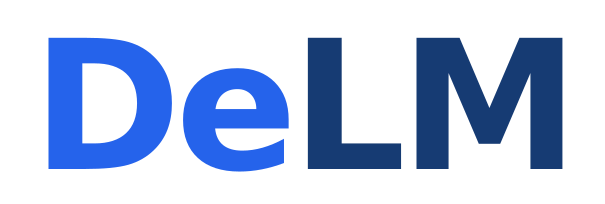
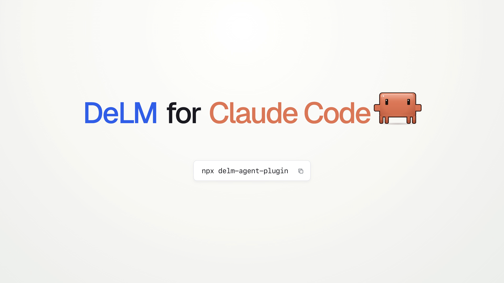

<p align="center">
  <a href="https://yuzhenmao.github.io/DeLM/">
    
  </a>
</p>

<h1 align="center">DeLM for Codex and Claude Code</h1>
<p align="center">Build faster with agents that work together.</p>

<p align="center">
  <a href="https://arxiv.org/abs/2606.10662"></a>
  &nbsp;
  <a href="https://yuzhenmao.github.io/DeLM/"></a>
  &nbsp;
  <a href="https://discord.com"></a>
</p>

<p align="center">
  <a href="#install-on-macos">Install</a> ·
  <a href="#run-a-task">Usage</a> ·
  <a href="docs/support.md">Support</a> ·
  <a href="CONTRIBUTING.md">Contributing</a>
</p>

DeLM lets agents work in parallel in your existing Codex or Claude Code workflow. A shared task queue coordinates the work, while shared context lets agents exchange findings and reuse each other's code. Their contributions come together in your project.

- **Work in parallel.** Agents claim tasks and pick up new work as it becomes available.
- **Share progress.** Findings, files, and relevant checks are available to the other agents as they work.
- **Keep your workflow.** Start a run in your usual conversation, send clarifications there, and receive the changes in your original project.

DeLM uses your existing host account and starts agents only when you ask.

<p align="center">
  <a href="video-demo/renders/delm-demo.mp4"></a>
  <br>
  <a href="video-demo/renders/delm-demo.mp4">Watch the 56-second Codex demo</a>
</p>

## Install on macOS

Build from source with Git, Python 3, Rust, and Xcode Command Line Tools. Install the CLI for your chosen host and complete its login first. Run the installation commands below from this repository's root. You can install either plugin or both.

### Codex

```sh
./scripts/install.sh
```

Restart Codex, open `/hooks`, and review and trust the DeLM hooks. Restart once more to load the configuration, then open Codex in the project you want to work on.

### Claude Code

Requires **Claude Code 2.1.289 or later**.

```sh
./scripts/build.sh --host claude
claude plugin marketplace add "$PWD" --scope user
claude plugin install delm@delm-local --scope user
```

Restart Claude Code, then open it in the project you want to work on. DeLM uses Claude's native plugins, skills, hooks, and MCP tools. Review any trust or permission prompts Claude presents.

See [support](docs/support.md) for updates, removal, and troubleshooting, or [development setup](docs/development.md) for local builds.

### Planned one-command install

The proposed package name is **`delm-agent`**. Once the package and prebuilt releases are published, installation will be:

```sh
npx --yes delm-agent@latest install
```

The installer detects your installed host. If both Codex and Claude Code are available, choose **Codex**, **Claude Code**, or **Both**. Explicit host flags are available for [scripted installation](packages/installer/README.md#host-selection).

This command is not available yet; the package name is not reserved. Contributors can [verify the installer locally](packages/installer/README.md#private-verification).

## Run a task

Open your host in the project you want to change, then invoke DeLM with a request:

| Host | Start a run |
| --- | --- |
| Codex | `$delm:run <your task>` |
| Claude Code | `/delm:run <your task>` |

For example, in Claude Code:

```text
/delm:run Build a task board with drag-and-drop columns, local persistence,
and keyboard controls. Include a README and test the main interactions.
```

Use `$delm:run` for the same request in Codex. Send clarifications in the same conversation while the agents work. In Claude Code, `/delm-status` shows progress and `/delm-stop` stops the run and preserves unfinished work. See [run control and recovery](docs/support.md) for both hosts.

The current version runs two agents in private project copies. They share contributions and divide useful checks, so a recorded check can be reused when it still applies to the result.

**The result is delivered to your original project.** DeLM preserves your Git index, merges compatible edits, and retains conflicts for recovery. Temporary worker directories are removed after safe delivery or recovery. When the delivered project needs dependency setup or a focused check, the parent completes it before reporting the result ready.

Choose one project smaller than 10 GB, including ignored files and Git history. DeLM initializes Git in that folder if needed without creating a commit. Runs have a 30-minute default allowance.

### Your host setup

Claude's native forks inherit the current conversation, model, system prompt, and available tools. Coordination tools pass through Claude's normal permission checks.

Codex workers preserve saved skills, plugins, hooks, MCP configuration, and permissions. Codex's current fork API does not expose all parent-process CLI overrides, so exact live-session parity is still a limitation. The [support guide](docs/support.md#codex-setup-and-capability-inheritance) explains what is inherited and how to check your setup.

## Documentation

| Guide | Contents |
| --- | --- |
| [Support](docs/support.md) | Requirements, permissions, updates, and recovery |
| [Architecture](docs/architecture.md) | Host adapters, shared coordination, and project delivery |
| [Contributing](CONTRIBUTING.md) | Development setup and verification |
| [Release guide](docs/releases.md) | Build qualification and distribution |
| [Claude integration](docs/claude-integration.md) | Native integration design and validation |

## Research

DeLM builds on **Decentralized Multi-Agent Systems with Shared Context**. See the [paper](https://arxiv.org/abs/2606.10662), [project website](https://yuzhenmao.github.io/DeLM/), and [research code](https://github.com/yuzhenmao/DeLM) for the method, evaluations, and agent trajectories.

## License

DeLM is licensed under [MIT](LICENSE). Third-party components retain their own licenses; see [NOTICE](NOTICE).
