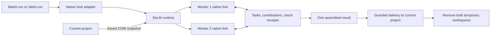

# Architecture

DeLM adds parallel execution to an explicitly requested Codex or Claude Code task. Two peers contribute to one result through a shared task queue, publications, and recorded checks.

## Source layout

| Area | Responsibility |
| --- | --- |
| `plugin/worker.md` | Shared collaboration instructions for both hosts. |
| `src/board/`, `src/evidence.rs`, `src/completion.rs`, `src/services.rs` | Task ownership, contributions, observed checks, completion, and preview coordination. |
| `src/workspace/`, `src/run/state.rs`, `src/supervisor.rs` | Project capture, delivery, recovery, durable ownership, and process checks. |
| `hooks/`, `skills/`, `src/run/`, `src/workers.rs`, `src/worker_tools.rs` | Codex hooks, skill, native app-server execution, and coordination transport. |
| `hosts/claude/`, `src/claude/` | Claude skills, plugin module, native MCP sidecar, and lifecycle controller. |
| `packages/installer/`, `scripts/` | Host selection, native installation, package assembly, and qualification. |
| `src/diagnostics.rs` | Local run inventory, privacy-safe timing reports, and guarded diagnostic cleanup. |

Host adapters translate native identities, permissions, events, and command outcomes into shared runtime inputs. They do not implement separate task-board or delivery algorithms.

## Invocation and native inheritance

### Codex

The trusted UserPromptSubmit hook recognizes an explicit invocation, captures its exact text and native identity, and starts the runtime. Duplicate delivery reconnects to the same capture. The parent follows an event stream rather than regenerating the request or issuing a separate startup-admission command. Native-bound launches establish their control ownership during startup; the separate unbound CLI retains its explicit control admission.

The runtime forks the parent thread through Codex's native app-server interface. It supplies a private working directory and DeLM coordination instructions while retaining ordinary saved configuration, native permission settings, authentication, and process environment. Project-relative configuration is rebound to the copied project. DeLM's worker marker prevents recursive DeLM hooks without disabling other hooks or plugins.

The source and worker skill inventories include content hashes. MCP inventories and returned native settings are compared during admission. A missing or changed capability produces an error instead of silently reducing the worker's tools.

Exact live-session parity is not met: a native fixture demonstrates a parent-process CLI override missing from a separate fork host. The current host also does not export every active tool connection or live instruction-provider state. The capability report records `exact_live_session_parity: false` and names those gaps. Native fork support and saved-configuration matching must not be advertised as a guarantee that every live integration has been cloned.

### Claude Code

Claude resources live in `hosts/claude/`. The official plugin module intercepts `/delm:run`, confirms its native MCP connection, and starts the shared Rust runtime before model work. The runtime captures the project and prepares two private working directories. A short parent model turn issues two native `fork` Agent calls together; spawn middleware assigns the prepared directories and binds the returned native identities. Both forks inherit the complete conversation and the shared worker policy. The parent passes a short instruction pointer instead of emitting that policy twice.

This launch turn is necessary in the qualified Auto permission mode: a plugin-origin direct spawn has no model-response classifier verdict. DeLM uses ordinary native Agent and SendMessage calls rather than overriding permissions. The parent handles launch, resume, and final handoff; peers do the implementation and checks.

User updates follow one delivery path per peer. Active peers receive native session append with plugin provenance, then a fresh native turn before acknowledging the new revision. This prevents an already captured model input from being treated as if it contained a later update. SendMessage resumes peers under their existing identities; a peer bound after an update receives the cumulative request before acknowledging it. Pending delivery prevents stale completion from ending the run.

The official MCP sidecar starts no workers when loaded. Middleware reserves a one-use ticket bound to the native worker, turn, request revision, tool name, and exact arguments. It then calls the native tool path, including permissions and approvals. Only the approved MCP invocation can consume that ticket. Duplicate, modified, stale, and unbound requests cannot mutate the board. A failed bridge does not authorize a fallback tool call.

`src/claude/controller.rs` owns lifecycle state; `src/claude/mod.rs` supplies the authenticated local control transport and MCP sidecar. The board, services, workspace capture, delivery, evidence validation, and `plugin/worker.md` policy are shared with Codex. Native wire events remain in their host adapters. See [native Claude integration](claude-integration.md) for the qualification boundary.

## Workspaces and coordination

Saved project files, including admitted staged, unstaged, and untracked changes, form a copy-on-write baseline. Each worker receives an independent tree and private Git administration. Ignored inputs and recognized credentials are recorded as exclusions. Existing account storage stays outside project copies.

Private working directories separate edits; they do not replace the user's native permission policy. Board transfers enforce their own contained-path and permission checks. This is trusted local development, not a hostile-code or network-isolation boundary.

When a worker declares a dependency wait, the runtime records the board position internally and checks readiness again after the native turn ends. Task creation, released work, and relevant peer contributions can resume the existing worker. Event ordering cannot discard a useful change between the declaration and the end of the turn, and duplicate events cannot start duplicate resumptions. These internal cursors do not alter the shared board returned to agents.

Both workers claim useful implementation work and expose follow-on tasks. Claims are versioned; updates, releases, and splits cannot let stale owners finish reassigned work. Either worker can temporarily own integration, with at most one active integration owner. The team owes one complete result, without a permanent manager or a requirement that both independently finish the whole task.

Codex matches each per-worker MCP request against its native call, thread, turn, revision, tool, and arguments. Claude uses the one-use native invocation tickets described above. Neither adapter trusts a worker identity supplied by the model. SQLite transactions protect queue mutations and retries. Publications freeze selected files. Imports reject incompatible local edits rather than overwriting them.

## Verification and previews

Component checks can run concurrently with implementation. `src/evidence.rs` distinguishes Codex process exit records from Claude native tool results; Claude receipts never invent a numeric exit code. Background, interrupted, timed-out, or unobserved tool results do not establish completed checks. Check receipts bind a native command outcome to its scope, snapshot, worker, and request revision. The integrating worker can reuse applicable evidence; changed scoped files invalidate it. Peer evidence retains its original provenance rather than becoming a fabricated local command ID. There is no mandatory second full-suite pass or verifier approval gate.

The snapshot is captured before the native command begins and compared again when the check finishes. A scope must include relevant source, tests, and configuration. A receipt establishes the observed outcome for those recorded inputs; it does not prove coverage, undeclared dependencies, ambient environment state, or the absence of transient changes between observations.

A service claim coordinates preview ownership before a worker starts a server through its normal native execution tools. Readiness records the actual loopback URL and owned process identity. The runtime verifies that the process owns the reported listener and binds the registration to fingerprints of its declared inputs. A repeated claim does not authorize a duplicate launch. Check ownership coordinates mutable preview scenarios; ordinary tool permissions still apply. A service declaration alone does not prove that all served source is immutable.

## Delivery, recovery, and shutdown

The selected folder is the project boundary. If it has no Git administration, preparation initializes an independent repository there through an atomic no-replace publication; it never discovers an ancestor or replaces an existing `.git` entry. Partial capture failures clean only identity-checked directories recorded in the preparation journal.

Updates and answers reach both existing worker sessions. Native interruption, explicit stop, owner exit, and the task deadline cancel work. Cleanup requires confirmed shutdown of owned execution. Unresolved shutdown preserves work and reports the cleanup limitation.

Codex owns separate app-server processes. Its supervisor stops the owned native turns, terminals, private hosts, and observed descendants before workspace removal. Claude shares the user's native host and does not terminate it. Its module stops recorded agents and background tasks through native APIs; terminal states and exact stop acknowledgments precede a scoped process-reference fence. That fence checks processes created since runtime startup and explicitly tracked processes, including registered services, without deriving kill authority from a working directory. It is a DeLM-scoped check, not a guarantee against arbitrary pre-existing external writers.

A durable Claude run record supports recovery after module reload or host exit. The shared project lock refuses a new Codex or Claude run over an unfinished Claude run; recovery may bypass only its own run record. An inconclusive ownership or shutdown check preserves the workspaces.

After confirming the selected result, delivery compares its source delta against the captured starting working tree. It preserves the original Git index and unrelated files, merges compatible concurrent text edits, and reports conflicting edits without overwriting them. Binary files, contained symlinks, executable modes, and deletions are represented explicitly. Incompatible file/directory type transitions require recovery.

A durable per-path journal precedes writes. Guarded replacements retain displaced original inodes in durable recovery, including after successful delivery, so writes through already-open descriptors are not discarded. Changed displaced entries detected before completion produce a recovery outcome. This does not provide global transaction isolation from external editors. Interrupted application never rolls back later user edits automatically. Conflict and cancellation recovery saves changed file blobs, before/after manifests, and any delivery journal before removing both worker trees and the baseline.

Source delivery excludes newly created dependency environments. Changed dependency manifests, omitted worker-local dependency environments, or files merged with concurrent user edits set `verification_required`. The report lists omitted environments in `environment_directories_omitted`; their presence in a worker does not prove readiness in the original project. The parent must perform the necessary native setup or focused check in the original project before presenting it as ready. Matching transferred bytes alone does not certify relocation.

Result capture applies a shared artifact policy. Codex supplies native exported read permissions for external runtime dependencies. Claude's explicit DeLM capability can validate a real virtual environment's external Python interpreter using its configuration, executable, and link structure; this narrow policy neither admits general external source links nor claims a native Read grant. Original-project and private-run storage exclusions remain in force.

Runtime metadata, usage, board evidence, completion records, and needed recovery data remain in private run storage. Temporary preview processes stop with the run. A requested final preview must start from the original project.

## Installation and qualification

Each host's native plugin manager installs its own self-contained DeLM package. The common installer detects the available host and offers Codex, Claude Code, or both when both are present. Scripts can select explicitly with `--host codex`, `--host claude`, or `--host both`. Codex uses its explicit-only skill and trusted hooks; Claude uses its explicit-only skill, plugin module, and MCP sidecar. DeLM does not replace either host executable or manage account login. A run retains a hash-verified copy of its runtime so later control commands do not depend on an unchanged installed package.

Codex compatibility checks validate the app-server methods and response fields in use. Claude packages are validated through its official CLI, with adapter tests and native checks for the required plugin APIs. Deterministic fixtures exercise ownership, cancellation, delivery, and cleanup without model calls. Native inheritance and real-task behavior need separate qualification; fixture success does not close the live-session parity gaps above or establish support on an untested release architecture. See [development](development.md) and [release qualification](releases.md).
