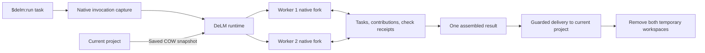

# Architecture

DeLM adds parallel execution to an explicitly requested Codex task. Two peers contribute to one result through a shared task queue, publications, and recorded checks.

## Invocation and native inheritance

The trusted UserPromptSubmit hook recognizes an explicit invocation, captures its exact text and native identity, and starts the runtime. Duplicate delivery reconnects to the same capture. The parent follows an event stream rather than regenerating the request or issuing a separate startup-admission command. Native-bound launches establish their control ownership during startup; the separate unbound CLI retains its explicit control admission.

The runtime forks the parent thread through Codex's native app-server interface. It supplies a private working directory and DeLM coordination instructions while retaining ordinary saved configuration, native permission settings, authentication, and process environment. Project-relative configuration is rebound to the copied project. DeLM's worker marker prevents recursive DeLM hooks without disabling other hooks or plugins.

The source and worker skill inventories include content hashes. MCP inventories and returned native settings are compared during admission. A missing or changed capability produces an error instead of silently reducing the worker's tools.

Exact live-session parity is not met: a native fixture demonstrates a parent-process CLI override missing from a separate fork host. The current host also does not export every active tool connection or live instruction-provider state. The capability report records `exact_live_session_parity: false` and names those gaps. Native fork support and saved-configuration matching must not be advertised as a guarantee that every live integration has been cloned.

## Workspaces and coordination

Saved project files, including admitted staged, unstaged, and untracked changes, form a copy-on-write baseline. Each worker receives an independent tree and private Git administration. Ignored inputs and recognized credentials are recorded as exclusions. Existing account storage stays outside project copies.

Private working directories separate edits; they do not replace the user's native permission policy. Board transfers enforce their own contained-path and permission checks. This is trusted local development, not a hostile-code or network-isolation boundary.

Both workers claim useful implementation work and expose follow-on tasks. Claims have ownership generations; updates, releases, and splits cannot let stale owners finish reassigned work. Either worker can temporarily own integration. The team owes one complete result, without a permanent manager or a requirement that both independently finish the whole task.

Per-worker MCP endpoints authenticate coordination requests to their bound worker identity. SQLite transactions protect queue mutations and retries. Publications freeze selected files. Imports reject incompatible local edits rather than overwriting them.

## Verification and previews

Component checks can run concurrently with implementation. Check receipts bind a native command outcome to its scope, snapshot, worker, and request revision. The integrating worker can reuse applicable evidence; changed scoped files invalidate it. Peer evidence retains its original provenance rather than becoming a fabricated local command ID. There is no mandatory second full-suite pass or verifier approval gate.

A service claim coordinates preview ownership before a worker starts a server through its normal native execution tools. Readiness records the actual loopback URL and owned process identity. The runtime verifies that the process owns the reported listener. A repeated claim does not authorize a duplicate launch. Check ownership coordinates mutable preview scenarios; ordinary tool permissions still apply. A service declaration alone does not prove that all served source is immutable.

## Delivery, recovery, and shutdown

The selected folder is the project boundary. If it has no Git administration, preparation initializes an independent repository there through an atomic no-replace publication; it never discovers an ancestor or replaces an existing `.git` entry. Partial capture failures clean only identity-checked directories recorded in the preparation journal.

Updates and answers reach both existing worker sessions. Native interruption, explicit stop, owner exit, and the task deadline cancel work. Process supervision closes native turns, terminals, hosts, and observed descendants before workspace removal. Unresolved shutdown preserves work and reports the cleanup limitation.

After confirming the selected result, delivery compares its source delta against the captured starting working tree. It preserves the original Git index and unrelated files, merges compatible concurrent text edits, and reports conflicting edits without overwriting them. Binary files, contained symlinks, executable modes, and deletions are represented explicitly. Incompatible file/directory type transitions require recovery.

A durable per-path journal precedes writes. Guarded replacements retain displaced original inodes in durable recovery, including after successful delivery, so writes through already-open descriptors are not discarded. Changed displaced entries detected before completion produce a recovery outcome. This does not provide global transaction isolation from external editors. Interrupted application never rolls back later user edits automatically. Conflict and cancellation recovery saves changed file blobs, before/after manifests, and any delivery journal before removing both worker trees and the baseline.

Source delivery excludes newly created dependency environments. Changed dependency manifests, omitted worker-local dependency environments, or files merged with concurrent user edits set `verification_required`. The report lists omitted environments in `environment_directories_omitted`; their presence in a worker does not prove readiness in the original project. The parent must perform the necessary native setup or focused check in the original project before presenting it as ready. Matching transferred bytes alone does not certify relocation.

Runtime metadata, usage, board evidence, completion records, and needed recovery data remain in private run storage. Temporary preview processes stop with the run. A requested final preview must start from the original project.

## Installation and qualification

Codex's native plugin manager installs DeLM. The explicit-only skill and trusted hooks supply its user entry point; DeLM does not replace the Codex executable. A run retains a hash-verified copy of its runtime so later control commands survive a plugin update.

Compatibility checks validate the native methods and response fields the implementation uses. Deterministic fixtures qualify ownership, cancellation, delivery, and cleanup without model calls. Native inheritance and real task behavior need separate qualification; fixture success does not close the live-session parity gaps above. See [development](development.md) and [release qualification](releases.md).
