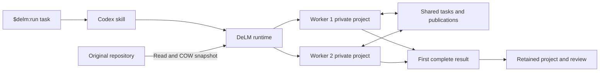

# Architecture

DeLM is an explicit-only skill and a local Rust runtime. Stock Codex loads the skill when the user invokes `$delm:run`. The parent supplies the task and relevant context, starts the runtime through its normal execution tool, and reports progress. It does not assign the workers' tasks.

## Workspace and authority

The runtime measures the complete original folder before snapshotting it. Native copy-on-write cloning has no copying fallback. Explicitly selected inputs are captured in a runtime-private staging directory, verified, and atomically published read-only to both workers. Ordinary task text is passed verbatim; earlier context remains separate. Workers start from one captured baseline with private Git administration and admitted staged and unstaged state. Their filesystem permissions explicitly deny the original.

A stock Codex app-server hosts two native threads, each with its own project, environment, and temporary directory. Native account storage stays in place. Configuration reads verify that unrelated extensions, hooks, external services, delegation, and inherited shell variables were disabled. Each thread's returned model, environment, and permission profile must match the request before a model turn starts.

Both workers have live web search, image inspection, network access, and private package caches, installation paths, and configuration. Installed toolchains are read-only. Direct filesystem access to the original project, peer files, and control storage remains denied. Networking supports dependency downloads and local servers; it does not enforce peer separation over the network. Workers must use the board for peer exchange.

Dynamic board tools bind the caller to its native thread. Model arguments cannot select another worker identity or destination root. SQLite transactions protect task claims, events, and retries. Publications freeze selected files; imports transfer complete files only when the receiving version matches the baseline or a known publication. Diverged edits require reconciliation. Board filesystem checks enforce containment independently of the model's native sandbox.

## Completion and control

The public CLI waits for its first authenticated `status --keep-alive` request before starting task workers. This proves that the parent can reach the control channel, including its private storage and socket. Preparation and permission delays consume no task model turns or execution allowance. Startup has a five-minute confirmation limit. Native-bound runs need no further heartbeat; the direct, unbound CLI retains an explicit monitoring lease. The internal fixture protocol already has a bidirectional control channel and does not need this handshake.

User updates increment a request revision and reach both existing sessions. A completion declaration must cover the whole task, reference the current revision, and be followed by normal native turn completion. Recorded command outcomes supply check evidence. A command is bound to the request revision observed when its start event arrived, so steering cannot relabel an older check. Arrival sequence boundaries also cover native events that were queued before the update but processed afterward. Native worker questions preserve their choices and request identities. Explicit answers resolve only the identified question and reach both peers as a new request revision. No separate reviewing model gates a ready result.

The skill reads progress and sends updates through a private control socket; completed status remains readable from durable storage. Native lifecycle events, explicit Stop, owner exit, and the overall deadline cancel work. A slow parent response does not cancel a native-bound run. A separate watchdog observes process identities and enforces termination if the runtime disappears.

Before retaining a winner, DeLM interrupts native turns, closes background terminals and threads, and stops the app-server and observed descendants. It then verifies that the candidate has not changed and captures a review. Result manifests retain every project entry, including generated outputs and dependencies. A narrow result-only policy permits qualified Python virtual-environment interpreter links and records their targets; source admission and board file containment stay strict. Cleanup occurs only after confirmed shutdown. Uncertain ownership preserves both projects. This is conservative process supervision for trusted development, not a container boundary against arbitrary daemonization.

## Installation and compatibility

Public releases package a prebuilt universal macOS runtime and use stock Codex's plugin manager. A marketplace catalog references an immutable package tag. Contributors can also build a local package. The skill's `allow_implicit_invocation: false` setting keeps its instructions out of ordinary model context. Native lifecycle hooks run only a short ownership handler; they never start workers. A manually invoked launch includes a fresh UUID. PreToolUse records its native session, turn, and exact host process identity. The runtime consumes that handshake, checks explicit native hook trust, and binds later cancellation to that invocation. Hooks record cancellation before attempting socket delivery, and the runtime polls the durable record before admission and result acceptance. Stale turn notifications are ignored. DeLM does not register SessionEnd; process identity checks detect owner exit. A consumed launch cannot be retried in the same native turn. There is no always-running MCP server. An active run must be stopped before disabling DeLM or revoking its hooks. Codex can remove a thread's hooks without terminating yielded processes; the plugin does not invent another polling service to emulate a native session connection.

The runtime uses Codex's app-server protocol, including experimental named permission profiles and dynamic tools. Before each public run, it checks the required methods and parameters, validates an ephemeral thread's effective configuration, and probes filesystem isolation using disposable files. These checks do not generate a model turn. Additive protocol changes are accepted; unsupported behavior is rejected. Native response validation continues to apply to the actual worker threads. No host patches or private login endpoints are used.

A run first retains a hash-verified copy of its executable outside the replaceable plugin cache and re-executes it before starting the async runtime. The process identity, arguments, and streams stay the same. The skill receives that retained path for subsequent control commands. Native upgrades and removal therefore do not invalidate active task control. Worker coordination, permissions, and completion rules are unchanged.

Task revisions, model selections, native events, usage records, deadlines, and results remain in private local run storage. Builds, qualification artifacts, product research, and design drafts are excluded from the source distribution.
